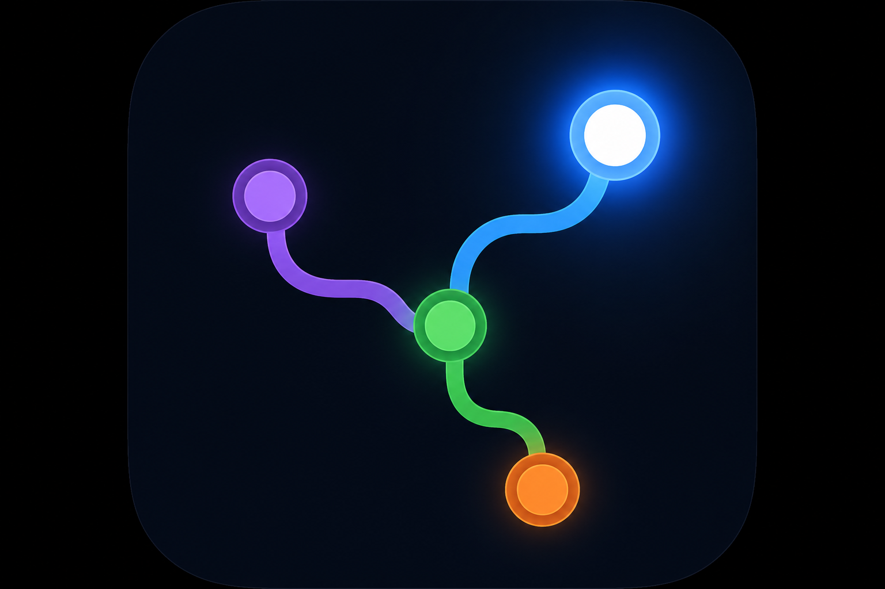
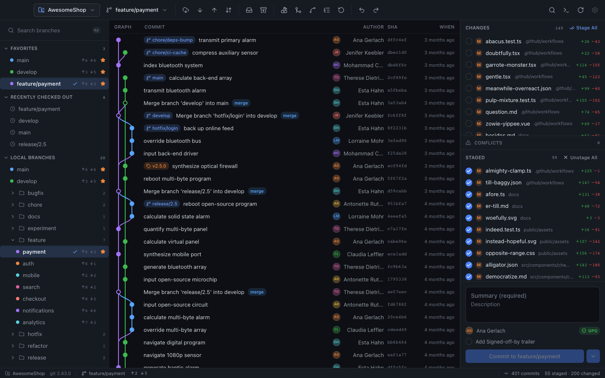

  

# Git Light

A desktop Git client with a graph-first interface — commit graph, branch sidebar, working tree panel, and real local repository operations.

**[ftuyama.github.io/git-light](https://ftuyama.github.io/git-light/)** · MIT License

## What is this?

Git Light is an Electron app with a three-pane repository view that runs **real Git commands** against local repositories via a typed IPC layer. Open a folder, browse history, manage branches, stage files, commit, fetch/pull/push, and inspect diffs.

## Features

| Area | Status |
|------|--------|
| Real Git backend (`git` CLI in main process; renderer never shells out) | ✅ |
| Open local repos · recent repos · startup screen | ✅ |
| Commit graph — lanes, refs, pagination, shift-compare, keyboard nav | ✅ |
| Branch sidebar — favorites, tags, stashes, worktrees (add/remove); drag-and-drop merge/rebase | ✅ |
| Working tree — flat/tree view, stage/unstage (patch hunks), commit | ✅ |
| Diff viewer — unified/split, syntax highlighting, per-hunk staging, blame, file history | ✅ |
| Fetch / pull / push / sync · remote maintenance (fetch all, prune, push tags) | ✅ |
| Merge / rebase / interactive rebase / cherry-pick (continue/abort banner) | ✅ |
| Merge conflict resolution (ours/theirs/per-block) | ✅ |
| Undo / redo (reflog-backed) · stash · search | ✅ |
| Integrated terminal (xterm + node-pty, ⌘T toggle in graph pane) | ✅ |
| Themes — Default, Dracula, Light, Claude, System (settings) | ✅ |
| Collapsible sidebars with expand rails · commit graph zoom | ✅ |
| Open on GitHub · app preferences (appearance, layout, graph, sidebar, credits) | ✅ |
| Credits & attribution (settings panel + native About dialog) | ✅ |
| Resizable three-pane layout · file watcher auto-refresh | ✅ |
| Auto-update check (packaged builds) · **Check for Updates…** menu | ✅ |
| Clone / hosting auth UI | ❌ Not yet |

## Quick start

Download the latest installer for your platform from **[GitHub Releases](https://github.com/ftuyama/git-light/releases)**:

| Platform | Installer |
|----------|-----------|
| macOS | `.dmg` |
| Windows | `.exe` (NSIS) |
| Linux | `.AppImage` or `.deb` |

### macOS

1. Open the DMG and drag **Git Light** into **Applications**.
2. Launch **Git Light** from Applications. Notarized releases open normally; ad-hoc signed builds may require **Right-click → Open → Open** on first launch.

### Windows

1. Run the `.exe` installer and follow the setup wizard.
2. Launch **Git Light** from the Start menu or desktop shortcut.

### Linux

1. **AppImage:** make executable (`chmod +x Git-Light-*.AppImage`) and run it.
2. **deb:** install with your package manager (`sudo dpkg -i git-light_*.deb`).

To check for updates later, use **Git Light → Check for Updates…** in the menu bar (macOS) or the application menu (Windows/Linux).

## Sponsor

If Git Light is useful to you, consider supporting ongoing development:

**[Sponsor on Ko-fi](https://ko-fi.com/lelouchiee)**

## For developers

See **[DEVELOPER.md](DEVELOPER.md)** for build instructions, scripts, and local development setup. Architecture, stack, and extension points are in **[ARCHITECTURE.md](ARCHITECTURE.md)**.
